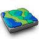
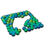
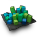
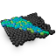
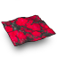
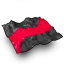
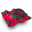
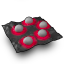

# Meadow

A scattering tool kit for SideFX Houdini.

Meadow is a set of nodes designed for environment creation and scattering in Houdini.
These nodes give extra control and complement existing workflows without having to change existing setups.

## Installation

Meadow is installed as a Houdini Package.

1. Go to the [Releases](https://github.com/beatreichenbach/houdini-meadow/releases) page and download the latest `meadow.zip`.
2. Navigate to your Houdini user preferences folder: `$HOME/houdini‹X›.‹Y›`
3. If you don't have a folder named `packages` in that directory, create it.
4. Extract the contents of the `.zip` file into the `packages` folder.
5. Restart Houdini. You can verify the installation by opening the **Package Browser** (**Windows > Package Browser**) and ensuring "Meadow" is listed.

**Example Folder Structure:**
```text
├── houdini21.0
    ├── packages/
        ├── meadow.json
        └── /meadow
            └── (HDA files)
```

## Usage

[](https://www.youtube.com/watch?v=4OrTQOgZnY8)


## Nodes 

|                                                          |                                                                                                                                                |
|----------------------------------------------------------|------------------------------------------------------------------------------------------------------------------------------------------------|
|                    | **Scatter:**  Similar to a standard scatter node, but it projects UVs onto the surface which preserves point positions with changing geometry. |
|                    | **Cluster:** Natural clustering of point indices using Perlin noise pattern.                                                                   |
|                        | **Prune:** Remove points based on attribute.                                                                                                   |
|    | **Point Transform:** Align points to set inital orientation and randomize point transforms.                                                    |
|          | **Frustum Cull:** Hide points outside the camera frustum to optimize heavy scenes.                                                             |
|          | **Mask Builder:** Preset-based node for layering noises like Perlin, Alligator and Worley.                                                     |
|        | **Mask by Curve:** Create masks based on curve proximity with falloff control.                                                                 |
|    | **Mask by Feature:** Create masks based on slope and altitude.                                                                                 |
|  | **Mask by Geometry:** Create masks based on geometry proximity with falloff control.                                                           |

## About this Repository

| Directory | Description                                                                                                         |
|-----------|---------------------------------------------------------------------------------------------------------------------|
| `work/`   | Houdini files that was used to create the icons, promotional materials and demos.                                   |
| `src/`    | Digital Assets and the package definition. During the release action they get packaged in the `meadow.zip` archive. |
| `build/`  | Build directory used to generate the release package.                                                               |


## License

MIT License. Copyright 2026 - Beat Reichenbach. See the [License](LICENSE) file for details.
